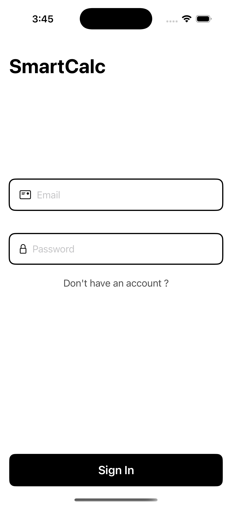
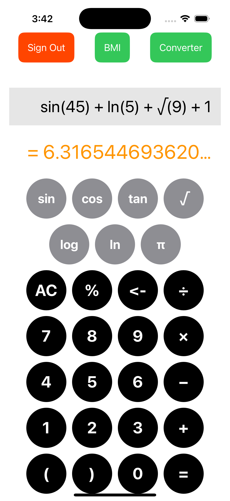
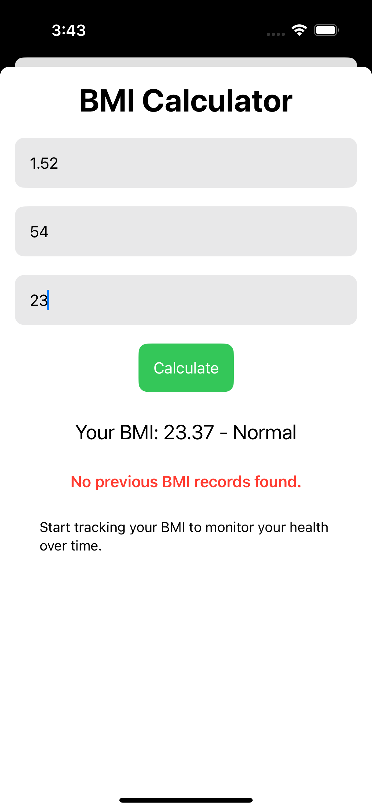
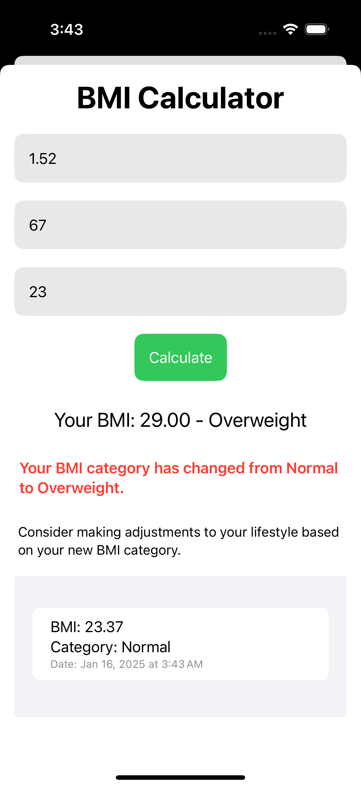
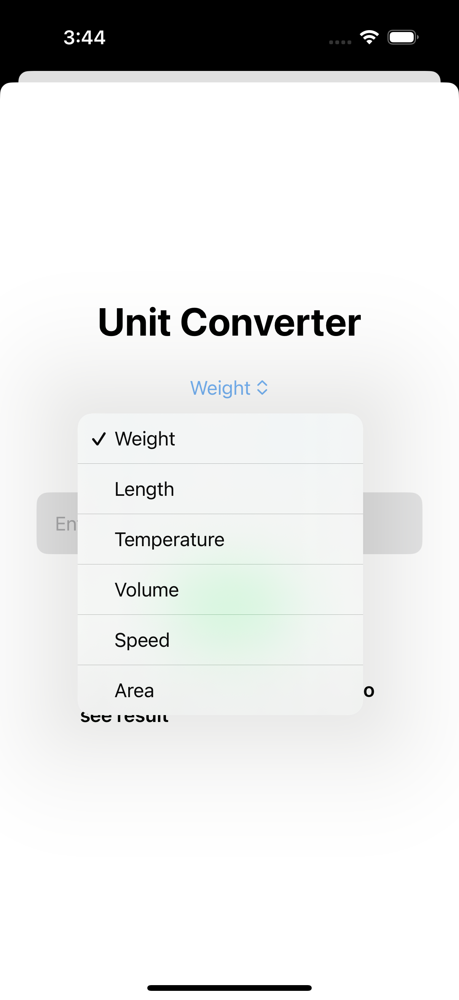
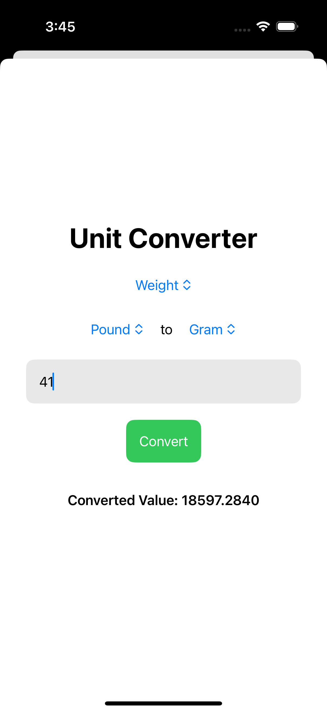

# SmartCalc
An iOS application for simple math, BMI measurement and unit onversion.

## Features
- User authentication
- A simple yet useful calculator
- Unit converter
- BMI measurement with health warning

## App Preview

## Authentication

  
  

### Calculator

## BMI Calculation With Health Warnings

  
  

## Unit Conversion

  
  

## Project Details
This project was developed as part of the course **Mobile Computing Laboratory (CSE 3218)** at **Khulna University of Engineering and Technology**.
- **Platform**: iOS
- **Language**: Swift
- **User Interface**: SwiftUI
- **Authentication**: Firebase Authentication
- **Database**: FireStore Database
- **Unit conversion API**: Rapid API
- **IDE Used**: XCode
- **Contributors**:
  - [Bishal Roy](https://github.com/IronDigger098)
  - [Faiyaz Mahmud](https://github.com/faiyaz103)
  - [Dipto Saha](https://github.com/DsDipto7) 